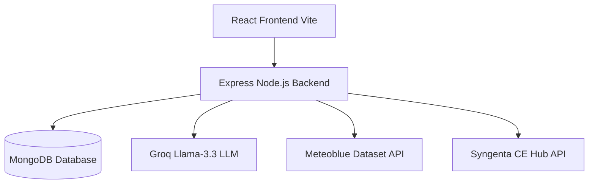

<div align="center">
  
  
  # 🌱 CropFit
  ### The Next-Generation Climate-Smart Farming Assistant
  
  [](https://reactjs.org/)
  [](https://nodejs.org/)
  [](https://www.meteoblue.com/)
  [](https://groq.com/)
</div>

---

## 🌍 The Problem
As climate change accelerates, farmers face unprecedented challenges: unpredictable heatwaves, erratic rainfall, and shifting pest life-cycles. Traditional farming intuition is no longer enough. Standard weather apps only tell a farmer that it will be 36°C tomorrow—they **do not** tell a farmer what 36°C means for their specific crop's growth stage, nor do they factor in historical climate anomalies.

## 🚀 Our Solution
**CropFit** is an end-to-end, AI-powered agricultural intelligence dashboard designed to bridge the gap between complex climate data and actionable agronomic advice. We combine real-time forecasting, 10-year historical climate baselines, and a proprietary agronomic physics engine to tell farmers exactly *what* to do, *when* to do it, and *why*.

---

## 🏆 How We Are Ahead of the Competition

While existing AgriTech solutions offer generic weather widgets and basic chatbots, CropFit pioneers several advanced capabilities:

### 1. 🕰️ 24-Hour Clockwise Climate Engine
Instead of a simple weather list, CropFit simulates a 24-hour microclimate clock for the farm. It calculates evaporation rates and heat stress hour-by-hour to define the **perfect irrigation window** (e.g., advising a farmer to water at 6:00 AM instead of 12:00 PM to save 45% of water lost to evaporation).

### 2. 📊 Meteoblue Historical Anomaly Detection
We don't just look at tomorrow's weather; we compare it against a **10-year historical baseline** using the Meteoblue API. 
* *Competitor:* "It will be 38°C tomorrow."
* *CropFit:* "Tomorrow is 3°C hotter than the 10-year average for this specific week. This is an extreme heat anomaly. Initiating Heat Stress Protocol for your Wheat crop."

### 3. 🧠 ML Explainability (Transparent AI)
Farmers distrust AI when it behaves like a "black box". Our Llama-3.3 integration includes an **Explainable AI Pipeline**. Before giving advice, the model generates an agronomic chain-of-thought (physics, soil moisture, and weather data). Farmers can click **"✨ View AI Explainability"** to see exactly how the AI arrived at its conclusion, building trust.

### 4. 🎙️ AI Voice Journaling (Speech-to-JSON)
To solve the data-entry barrier for farmers, we built an AI Voice Log. A farmer simply clicks the microphone and speaks naturally: *"I sprayed 2 liters of pesticide today and it cost me 1500 rupees."* The LLM parses the audio transcript in real-time, structuring it into a strict JSON schema and logging it directly into the farm's timeline.

### 5. 🔮 "What-If" Climate Simulator
Farmers can adjust sliders for Temp (+3°C Heatwave) and Rainfall (-25% Drought) to instantly see the projected impact on their crop yield, water consumption, and net profit.

---

## ⚙️ Architecture & Tech Stack



* **Frontend**: React 18, TailwindCSS, Lucide Icons, Vite
* **Backend**: Node.js, Express, TypeScript, Mongoose
* **Database**: MongoDB (Atlas)
* **AI & ML**: Groq SDK (Llama-3.3-70b-versatile) for rapid reasoning and Speech-to-JSON parsing.
* **Climate Data**: 
  * **Meteoblue**: Historical baseline anomalies & severity scoring.
  * **CE Hub (Syngenta)**: Hyper-local 7-day agricultural forecasts.

---

## 📸 Key Features in Action

1. **Dashboard Overview**: View live anomaly alerts and crop health status.
2. **AI Voice Assistant**: Multilingual Chatbot with deep context awareness and explainability.
3. **Disease Scanner**: Upload leaf photos to detect fungal/bacterial infections with tailored pesticide dosage recommendations.
4. **API Tester**: A dedicated developer route (`/api-tester`) proving our live integration with the Meteoblue historical dataset.

---

## 🚀 Local Setup & Installation

### Prerequisites
- Node.js (v18+)
- MongoDB Atlas URI
- API Keys for Groq, Meteoblue, and CE Hub

### 1. Clone the repository
```bash
git clone https://github.com/rautsiddharth82-crypto/Cropfit.git
cd Cropfit
```

### 2. Setup Backend
```bash
cd backend
npm install
# Create a .env file based on .env.example
npm run dev
```
*(The backend runs on `http://localhost:3000`)*

### 3. Setup Frontend
Open a new terminal window:
```bash
cd .. # Go back to root
npm install
npm run dev
```
*(The frontend runs on `http://localhost:5173` and proxies `/api` calls to the backend)*

---
<div align="center">
  <p><i>Empowering farmers with data, predictability, and peace of mind.</i></p>
</div>
